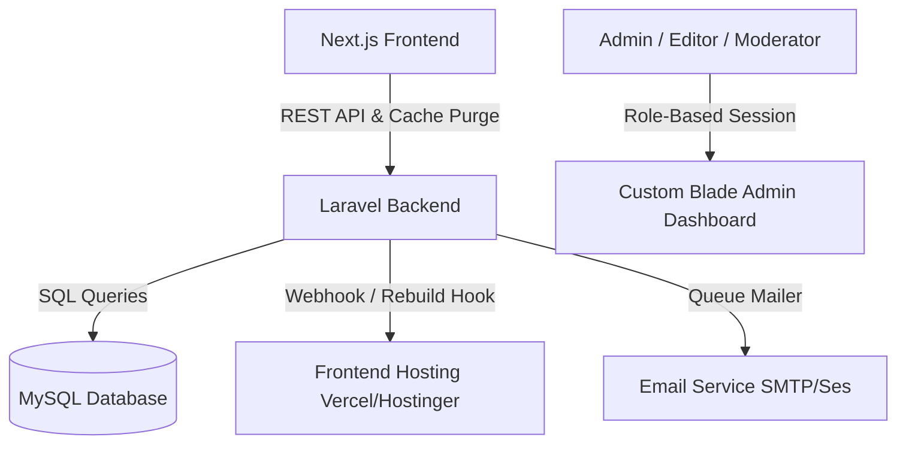

# Implementation Plan: Scalable Laravel CMS (Custom Admin, RBAC, & Advanced Blogging Features)

This plan details the technical setup for a scalable, highly secure, custom Laravel 11 + MySQL headless CMS. It incorporates custom Role-Based Access Control (RBAC), a Sanity data migration script, and modern blogging features suited for a premium portfolio site.

---

## Technical Stack & Scalability Architecture

1. **Core**: Laravel 11 & MySQL.
2. **Dashboard UI**: Custom Blade layouts styled with TailwindCSS & Alpine.js for interactive micro-animations.
3. **Authentication**: Laravel Session-based Auth.
4. **Authorization (RBAC)**: Custom Database-driven roles and permissions using Laravel Gates/Policies.
5. **Next.js API**: API controllers with rate limiting, cache tags, and webhook dispatching.



---

## Database Schema (Scalable RBAC & Features)

### 1. User & Role Management
* **`users`**: `id`, `name`, `email`, `password`, `created_at`, `updated_at`.
* **`roles`**: `id`, `name` (e.g. Super Admin, Editor, Moderator), `slug` (unique), `permissions` (JSON array of permissions, e.g., `["posts.create", "comments.approve"]`).
* **`role_user`**: `user_id` (FK), `role_id` (FK). (Supports multiple roles per user for maximum scalability).

### 2. Core Blogging Content
* **`posts`**: `id`, `title`, `slug` (unique), `excerpt`, `body` (LONGTEXT - Markdown), `main_image` (VARCHAR), `published_at` (TIMESTAMP), `likes_count` (INT), `user_id` (FK - author).
* **`comments`**: `id`, `post_id` (FK), `parent_id` (FK, self-referential), `name`, `comment`, `user_id` (anonymous reader ID), `approved` (BOOLEAN).

### 3. Advanced Modern Features
* **`post_revisions`**: `id`, `post_id` (FK), `user_id` (FK - editor), `title`, `excerpt`, `body`, `created_at` (for post version history and rollback).
* **`activity_logs`**: `id`, `user_id` (FK, nullable), `action` (VARCHAR, e.g. "approved_comment"), `description` (TEXT), `ip_address`, `created_at` (audit log).
* **`subscribers`**: `id`, `email` (unique), `verified_at` (TIMESTAMP, nullable), `subscribed_at`.
* **`analytics`**: `id`, `post_id` (FK), `views` (INT, default 0), `reads` (INT, default 0), `date` (DATE, unique composite key with post_id).

---

## Scalable Custom RBAC Design

Instead of relying on heavy third-party packages, we will implement a clean, lightweight RBAC mechanism using Laravel's native **Gates and Policies**:

1. **Defining Permissions**: Roles will store permissions as JSON arrays (e.g. `["posts.create", "posts.edit", "comments.approve", "users.manage"]`).
2. **Access Middleware**:
   We will create a custom middleware `check.permission` that intercepts requests:
   ```php
   // routes/web.php
   Route::get('/admin/users', [UserController::class, 'index'])->middleware('permission:users.manage');
   ```
3. **Blade Gate Directives**:
   Control visibility of buttons or navigation items directly in Blade:
   ```html
   @can('posts.create')
       <a href="/admin/posts/create" class="btn">Create Post</a>
   @endcan
   ```

---

## Modern Advanced CMS Features

### 1. Real-time SEO Analyzer (Blogging Tooling)
- **Feature**: While writing or editing a post in the custom dashboard, a sidebar panel analyzes the title, excerpt, and content in real-time.
- **Checks**:
  - Keyword density check (compares against a "Focus Keyword" input).
  - Meta description and title length limits (gives visual indicators: Red, Orange, Green).
  - Image alt tag validation.

### 2. Revision History / Version Control
- **Feature**: Every time a post is updated, a copy of the old title, excerpt, and markdown body is saved in the `post_revisions` table.
- **UI**: A history log inside the post edit screen allowing the admin to preview past edits and click "Restore" to roll back changes.

### 3. Automating Webhooks & Cache Purging
- **Feature**: When a blog post is published, updated, or a comment is approved, Laravel dispatches a background job.
- **Action**: It triggers a Webhook (e.g., Netlify/Vercel Deploy Hook) or automatically sends a cache purge request to the Hostinger frontend to rebuild pages instantly (ISR / Static Regeneration).

### 4. Native Newsletter & Broadcasting Queue
- **Feature**: Manage subscribers list from the dashboard.
- **Broadcast**: When a post is published, the admin can click "Broadcast" to queue newsletters to all subscribers. Laravel will run the mail deliveries in the background using queues to avoid slowing down the dashboard.

### 5. Audit Log (Activity Tracker)
- **Feature**: Every time an action is taken (e.g., an Editor edits a post, a Moderator deletes a comment), it is logged in the `activity_logs` database table.
- **Security**: The Super Admin can view a central Audit Logs page to monitor backend actions.

---

## Data Migration Strategy

We will build `php artisan migrate:sanity`.
1. **Download Content**: Pull all authors, categories, posts, and comments.
2. **Map RBAC**: Assign migrated author documents to users with correct roles.
3. **Parse Portable Text**: Convert block JSON documents to Markdown.
4. **Localize Images**: Download cover images locally, storing paths in MySQL.
5. **Reconstruct Threads**: Insert comments and map Sanity's parent refs to the new database `parent_id` foreign keys.

---

## Step-by-Step Execution Plan

### Phase 1: Custom Backend Setup & Custom RBAC
1. Install Laravel 11 & set up DB configuration.
2. Build migrations (`roles`, `users`, `posts`, `comments`, `revisions`, `logs`, etc.).
3. Implement Custom Roles/Permissions Middleware and Gate definitions.
4. Create seed script to create initial roles (Super Admin, Editor, Moderator) and a default Super Admin account.

### Phase 2: Custom Admin Dashboard & Editor
1. Design admin layout with TailwindCSS & Alpine.js.
2. Build login, posts list, and posts editor (using EasyMDE + custom SEO sidebar).
3. Build comments moderation list with parent-child reply nesting.
4. Build activity logs viewer for Super Admin.

### Phase 3: Sanity Migration Command
1. Write and run `php artisan migrate:sanity`.
2. Verify migrated data shows up in correct tables under correct author accounts.

### Phase 4: APIs & Next.js Rebuild Hooks
1. Create api endpoints for posts, likes, comments (threaded), and analytics.
2. Implement Vercel/Hostinger cache purge webhook on post changes.
